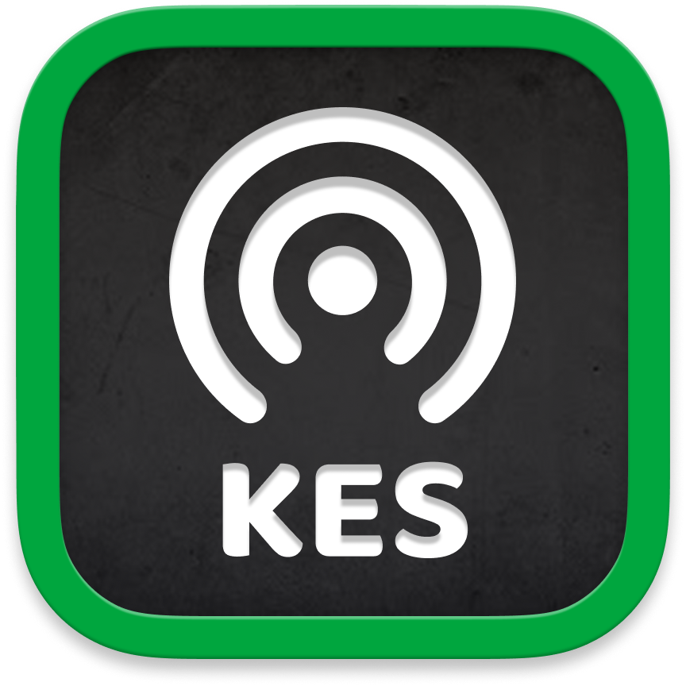
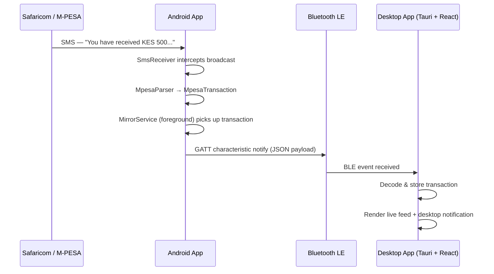

<p align="center">
  
</p>

<h1 align="center">PesaCast</h1>

<p align="center">
  Real-time M-PESA transaction mirroring from your Android phone to your desktop.<br/>
  PesaCast intercepts incoming M-PESA SMS messages on Android, parses them into structured transaction data, and streams them live to a companion desktop app — over Bluetooth LE.
</p>

---

## Demo

<video src="screenshots/demo.mp4" controls width="100%"></video>

---

## How It Works



---

## Project Structure

```
pesacast/
├── android/        # Android app — SMS interception & broadcasting
└── desktop/        # Desktop app — Tauri (Rust) + React frontend
```

---

## Tech Stack

### Android (`android/`)

| Concern | Technology |
|---|---|
| Language | Kotlin |
| Min SDK | 26 (Android 8.0 Oreo) |
| Architecture | MVVM (ViewModel + ViewBinding) |
| Async | Kotlin Coroutines |
| Bluetooth | Android BLE APIs (GATT server) |
| SMS interception | `BroadcastReceiver` + `MpesaParser` |
| Background | Foreground service + `BootReceiver` (auto-start on boot) |
| Serialization | Gson |

### Desktop (`desktop/`)

| Concern | Technology |
|---|---|
| Framework | Tauri v2 (Rust backend + web frontend) |
| Frontend | React 19 + TypeScript |
| Build tool | Vite 7 |
| Styling | Tailwind CSS v4 |
| UI components | shadcn/ui + Radix UI |
| Icons | Lucide React |
| BLE (desktop) | `@mnlphlp/plugin-blec` + vendored `btleplug` |
| WebSocket server | `tokio-tungstenite` |
| Desktop notifications | `@tauri-apps/plugin-notification` |
| Package manager | pnpm |

---

## Prerequisites

### Android

- Android Studio (Hedgehog or later)
- Android device or emulator running API 26+
- A Safaricom SIM registered for M-PESA

### Desktop

- [Node.js](https://nodejs.org) 20+
- [pnpm](https://pnpm.io) — `npm install -g pnpm`
- [Rust](https://rustup.rs) (stable toolchain)
- Tauri prerequisites for your OS — see [Tauri v2 prerequisites](https://v2.tauri.app/start/prerequisites/)

---

## Getting Started

### 1. Clone the repo

```bash
git clone https://github.com/davidamunga/pesacast.git
cd pesacast
```

### 2. Run the Android app

Open the `android/` folder in Android Studio, connect your device, and run the `app` configuration.

> The app requires the following permissions (granted at runtime on first launch):
> - `RECEIVE_SMS` — to intercept M-PESA messages
> - `BLUETOOTH_SCAN` / `BLUETOOTH_CONNECT` / `BLUETOOTH_ADVERTISE` — for BLE transport
> - `POST_NOTIFICATIONS` — for foreground service notification

### 3. Run the desktop app

```bash
cd desktop
pnpm install
pnpm tauri dev
```

To build a production binary:

```bash
pnpm tauri build
```

---

## Connecting Android to Desktop

PesaCast supports one transport mode currently.

### Bluetooth LE

1. Enable Bluetooth on both devices.
2. Open the desktop app — it will begin scanning automatically.
3. Open the Android app and start the mirror service. The devices will pair and connect.

---

## Parsed Transaction Fields

Each M-PESA SMS is parsed into the following structure:

| Field | Description |
|---|---|
| `type` | Transaction type (e.g. `RECEIVED`, `SENT`, `PAYBILL`, `BUY_GOODS`, `WITHDRAW`) |
| `amount` | Transaction amount |
| `currency` | Currency (e.g. `KES`) |
| `sender` / `recipient` | Counterparty name or number |
| `reference` | M-PESA confirmation code |
| `timestamp` | Date and time of the transaction |
| `balance` | Remaining M-PESA balance after the transaction |

---

## License

[MIT](./LICENSE) © 2026 David Amunga
